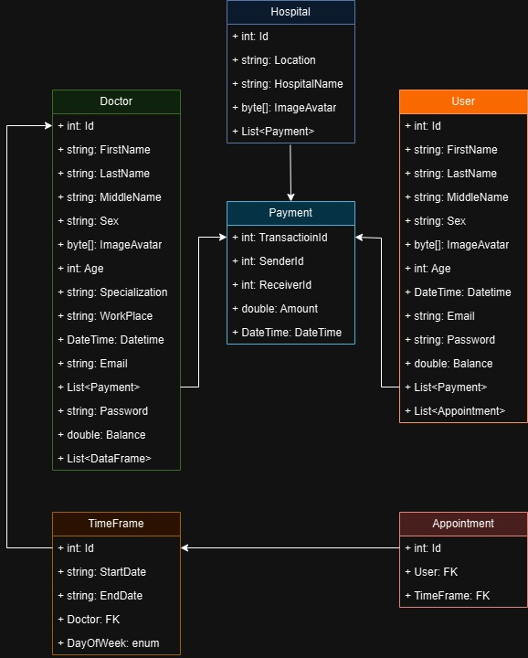
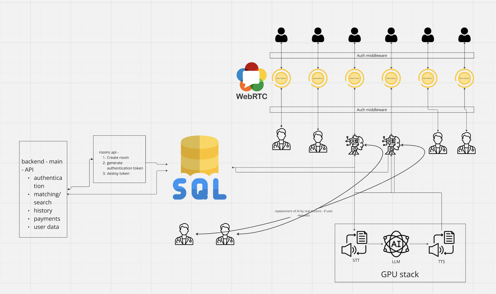

# 🏥 **AI-Powered Healthcare Platform**

## 📋 **Introduction**

This project is an AI-powered healthcare platform designed to automate patient interactions, manage appointments, and provide relevant healthcare information. The system leverages cutting-edge technologies to deliver a robust and efficient service, integrating real-time and traditional web protocols for a seamless user experience. User have access to free provided consultations, appointments, and can get information about their health status.

🚀 Services

Our platform provides a comprehensive suite of services tailored to streamline patient-provider interactions and optimize healthcare operations. Below are the key services offered:

🏥 Patient Interaction Management

    •	📅 Appointment Scheduling: Automates booking, rescheduling, and canceling of appointments with real-time availability updates, reducing administrative workload.
    •	📝 Digital Check-ins: Facilitates pre-appointment check-ins with secure data entry, ensuring smooth onboarding and minimizing wait times.
    •	📊 Patient Data Collection: Collects and organizes patient information efficiently, integrating it seamlessly into healthcare provider systems.

📞 AI-Powered Call Center

    •	🗣️ Intelligent Voice Assistant: Handles incoming patient calls, answers common queries, and redirects to the appropriate healthcare professional if needed.
    •	📈 Predictive Analysis: Uses AI to predict patient needs based on historical interactions, enhancing the user experience with personalized service.
    •	🗣️ Multilingual Support: Supports multiple languages to cater to a diverse patient population, ensuring effective communication regardless of language barriers.

🩺 Remote Consultations

    •	📹 Video Consultations: Enables secure, high-quality video calls between patients and healthcare providers, offering a virtual alternative to in-person visits.
    •	📡 Real-time Communication: Facilitates real-time voice and video communication with low latency, enhancing the interaction experience.
    •	📝 Post-Consultation Summaries: Automatically generates summaries of consultations, including prescribed medications and follow-up steps.

🔍 Healthcare Information Services

    •	🧑‍⚕️ Symptom Checker: An AI-driven tool that helps patients understand potential conditions based on reported symptoms.
    •	📚 Health Education: Provides reliable and up-to-date health information, including tips on managing conditions, lifestyle recommendations, and preventive care.
    •	🔔 Alerts and Reminders: Sends automated reminders for medications, follow-up appointments, and health checks, helping patients stay on track with their care plans.

📊 Analytics and Reporting

    •	📈 Performance Dashboards: Offers real-time insights into call center performance, appointment trends, and patient interaction metrics.
    •	🔍 Predictive Analytics: Analyzes data to forecast demand, optimize staffing, and identify areas for service improvement.
    •	📑 Compliance Reporting: Generates reports for compliance with healthcare regulations, ensuring all interactions adhere to industry standards.

🔐 Security and Compliance

    •	🔒 Data Encryption: Protects all patient data with end-to-end encryption, ensuring confidentiality and security.
    •	🛡️ HIPAA Compliance: Adheres to healthcare regulations, including HIPAA, to maintain patient privacy and data integrity.
    •	📝 Audit Trails: Maintains detailed logs of all interactions for transparency and accountability.

## 📝 **UML Diagram: System Architecture Overview**

This AI-powered healthcare platform connects **Users**, **Doctors**, **Hospitals**, and a **Payment** system to manage appointments, consultations, and financial transactions.




### 🏥 Hospital Entity
- **Attributes**: Id, Location, HospitalName, ImageAvatar
- **Relationships**: Linked to multiple **Payments** for tracking transactions. Hospitals host doctors and manage payment flows.

### 👩‍⚕️ Doctor Entity
- **Attributes**: Id, FirstName, LastName, Specialization, WorkPlace, Email, Balance
- **Relationships**: Linked to **Payment** for handling consultations and **TimeFrame** for scheduling availability. May be part of a hospital or operate independently.

### 👤 User Entity
- **Attributes**: Id, FirstName, LastName, Email, Balance
- **Relationships**: Users book appointments via **TimeFrame** and make payments via the **Payment** system.

### 💸 Payment Entity
- **Attributes**: TransactionId, SenderId, ReceiverId, Amount, Datetime
- **Relationships**: Tracks payments between **Users**, **Doctors**, and **Hospitals**.

### 🕰️ TimeFrame Entity
- **Attributes**: Id, StartDate, EndDate, DoctorId, DayOfWeek
- **Relationships**: Defines **Doctor** availability for **Appointments**.

### 📅 Appointment Entity
- **Attributes**: Id, UserId, TimeFrameId
- **Relationships**: Links **Users** to available time slots for consultations with **Doctors**.

### 💳 Entity Interactions
- **Users** book appointments with **Doctors** through **TimeFrames** and handle payments via the **Payment** system.
- **Hospitals** facilitate transactions and host doctors.

## 🛠️ **Architecture**

The architecture is built on a **microservices** approach, ensuring scalability, modularity, and ease of maintenance. Key components include:

### 🔹 **Frontend**

- **Technology**: `Swift` using `UIKit`
- **Purpose**: A modern and responsive UI for patients and healthcare providers.

### 🔹 **Backend**

- **Technology**: `.NET Core`, `Golang`, `Python`
- **Purpose**: High-performance backend for data processing and interaction management.

### 🔹 **Database**

- **Technology**: `Microsoft SQL Server (MSSQL)`
- **Purpose**: Reliable, high-performance data management.

### 🔹 **Communication Protocols**

- **WebRTC**: Real-time audio/video calls.
- **HTTP/HTTPS**: RESTful API interactions.



## 🧑‍💻 **Technological Stack**

### 📱 **iOS Mobile App**

- **Framework**: `UIKit`
- **Why?** A modern and intuitive framework with tools for creating responsive and visually appealing user interfaces.

### ⚙️ **Backend: C# .NET, Golang, Python**

- **Frameworks**: .NET Core, Go-Fiber, FastAPI, PyTorch, Transformers, XTTS
- **Overview**: Combines C# .NET, Golang, and Python for a high-performance, scalable backend.

### 🗄️ **Database: Microsoft SQL Server (MSSQL)**

- **Scalability**: Supports large-scale applications with complex transactions.
- **Performance**: Optimized with advanced query processing and in-memory capabilities.
- **Security**: Robust features like encryption, threat detection, and compliance.
- **Integration**: Seamless with other Microsoft tools and services.

### 🔗 **Communication Protocols**

- **WebRTC**: Low-latency real-time communication for audio and video calls.
- **HTTP/HTTPS**: Reliable data transmission via RESTful APIs.

## 🤖 **AI Assistant**

The AI Assistant is a cornerstone of the platform, enabling intelligent and seamless interaction between users and the healthcare call center.

### 🌟 **Key Features**

- **🗣️ Speech-to-Text (STT)**: Converts speech into text using advanced recognition models.
- **💬 Large Language Model (LLM)**: Processes text to generate intelligent, context-aware responses tailored for healthcare interactions.
- **🔊 Text-to-Speech (TTS)**: Transforms responses back into speech with a human-like voice output.

### ⚡ **Performance and Latency**

- **Ultra-Low Latency**: End-to-end latency from STT to LLM processing and TTS generation is under **`500 ms`**, ensuring near real-time interactions.

### 🧠 **Technological Advantages**

- **Accuracy**: Combines high-quality `STT` and `TTS` with LLM for precise responses.
- **Scalability**: Handles over **3000+ concurrent meetings on a single server**.
- **Security and Compliance**: Adheres to healthcare standards, ensuring data privacy.

### 🌐 **Available Languages:**

```plaintext
• English • Spanish • French • German • Italian • Uzbek • Russian
```

### 📊 **Protocol Performance Overview**

| **Protocol**      | **Average Latency (ms)** |
| ----------------- | ------------------------ |
| 📞 **WebRTC**     | 50-150 ms                |
| 🌐 **WebSockets** | 200-300 ms               |
| 📶 **VoIP**       | 250-400 ms               |
| 🖥️ **HTTP**       | 500-1000 ms              |

# Team Members

- **Mekhriddin Jumayev** - \*IOS/mobile developer - [github](https://github.com/mj8393)
- **Jonibek Yarashev** - _Backend Developer_ --- [github](https://github.com/YaJohny)
- **Aslonkhuja Khamidov** - _AI Specialist_ --- [github](https://github.com/aslon1213)
